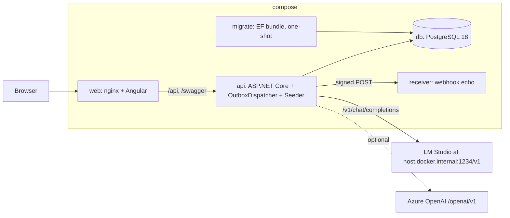
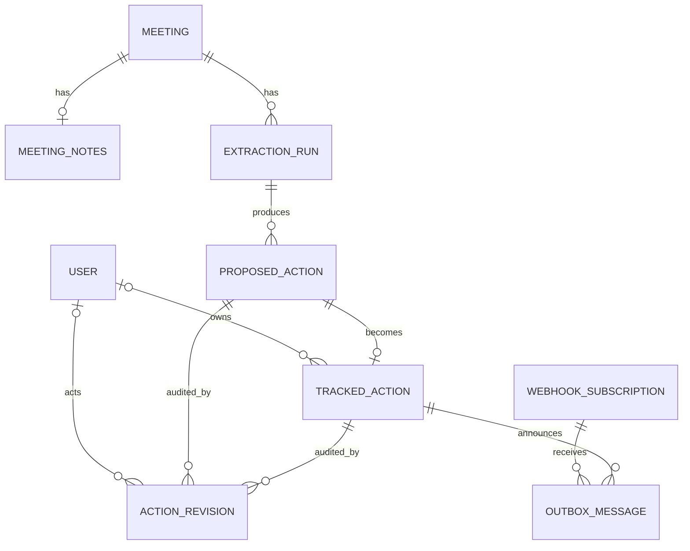

# Architecture Spine — ActionLedger

## Design Paradigm

Clean Architecture, four rings, dependencies point inward only. Use cases are plain handler classes, one per use case, called directly by controllers. Every use case is one database commit. Shared state changes only through aggregate root methods, which also emit the audit rows and domain events for that change. Side effects that leave the process go through a transactional outbox.

| Ring | Project | Holds |
| --- | --- | --- |
| Domain | `src/ActionLedger.Domain` | Aggregate roots, entities, value objects, enums, domain events, transition rules, the Overdue expression. References nothing. |
| Application | `src/ActionLedger.Application` | Use-case handlers, queries and read models, DTOs, ports (`IActionExtractor`, `IAiProviderInfo`, `IExtractionSettings`, `IPromptCatalog`, repositories, `IActionRevisionRepository`, `IReadDb`, `IUnitOfWork`, `IClock`, `ICurrentUser`, `IWebhookDispatcher`, `IWebhookPayloadBuilder`, `IWebhookSigner`), `ExtractionOutput` and its schema, `TextNormalization`, `ExcerptVerifier`, `OwnerResolver`. References Domain only. |
| Infrastructure | `src/ActionLedger.Infrastructure` | EF Core `AppDbContext`, repositories, outbox pipeline, AI provider adapters, prompt catalog, outbox dispatcher, HMAC signer, password hasher, JWT issuer, seeder. Implements Application ports. |
| Api | `src/ActionLedger.Api` | Controllers, auth wiring, OpenAPI, ProblemDetails mapping, DI composition root, hosted services registration. |

```mermaid
graph TD
  Api --> Application
  Api --> Infrastructure
  Infrastructure --> Application
  Application --> Domain
  Web[web/actionledger-web] -. generated client from committed openapi.json .-> Api
  Eval[tests/Eval] --> Infrastructure
  Eval --> Application
  Tests[tests/*] --> Api
```

## Invariants & Rules

### AD-1 — Dependency direction is enforced by a test [ADOPTED]

- **Binds:** all backend projects
- **Prevents:** Domain or Application quietly taking on EF Core, ASP.NET Core, or an AI SDK
- **Rule:** `Architecture.Tests` uses NetArchTest.eNhancedEdition to fail the build if: Domain references any package or project; Application references any project but Domain or any package outside `Microsoft.Extensions.Logging.Abstractions`, `Microsoft.Extensions.DependencyInjection.Abstractions`, and `System.Text.Json`; Domain or Application reference EF Core, ASP.NET Core, Npgsql, `OpenAI`, or `Microsoft.Extensions.AI`; any project references Api; any type outside `Application/Ai` has a name containing `Normaliz`. Infrastructure may reference Application and Domain only.

### AD-2 — One handler class per use case, no mediator [ADOPTED]

- **Binds:** Application, Api
- **Prevents:** logic split between controllers and handlers; a mediator library with a commercial license
- **Rule:** Each write use case is `<Verb><Noun>Handler` with a single `HandleAsync(Command, CancellationToken)`; reads are `<Feature>Queries` over `IReadDb`. Controllers validate the HTTP shape, call one handler or query, and map the result. A controller never touches a repository or `DbContext`. Handlers take the actor from `ICurrentUser` and the time from `IClock`, never from the command.

### AD-3 — Aggregate roots own their state; one mutation path per state machine

- **Binds:** Domain, Application, all writers
- **Prevents:** two code paths that change Review State or Action Status differently; child entities saved without their root; events raised where the persistence layer cannot see them
- **Rule:** Aggregate roots are `Meeting` (owns `MeetingNotes` only, exposes `HasNotes`), `ExtractionRun` (owns `ProposedAction` list; created by `ExtractionRun.Start(meeting, notes, provider, model, promptVersion, schemaVersion, actor, now)`), `TrackedAction` (owns no child collection), `ActionRevision`, `User`, `WebhookSubscription`, `OutboxMessage`. Repositories exist only for roots: `IMeetingRepository`, `IExtractionRunRepository`, `IActionRepository` (Tracked Actions, the seed's name), `IActionRevisionRepository` (append and ordered read only), `IUserRepository`, `IWebhookSubscriptionRepository`, `IOutboxRepository`. Repositories load, add, and query; they never save. `ProposedAction.Decide(kind, edits, actor, now)` is the only way Review State changes; it returns a `DecisionResult` carrying the new `TrackedAction` (when Approved or Edited) and the revisions produced, and it raises `TrackedActionCreated` on the returned `TrackedAction` root through `AggregateRoot.Raise`. `DecideProposalHandler` must add that root through `IActionRepository.Add` and the revisions through `IActionRevisionRepository.AddRange` before committing; `Application.Tests` asserts both adds. `TrackedAction.Transition(status, actor, now)` and `TrackedAction.Edit(changes, actor, now)` are the only ways Action Status and fields change and likewise return their revisions. Invalid transitions throw `DomainRuleException`, mapped to HTTP 409. Setters are private. `ProposedAction` keeps `ReviewState`, `DecidedByUserId`, `DecidedAt`, and `RejectionReason` as a read-optimized copy; the ReviewDecision revision is authoritative and `Infrastructure.Tests` asserts they agree after each decision kind.

### AD-4 — Proposed Actions and Tracked Actions are separate tables [ADOPTED]

- **Binds:** Domain, Infrastructure, Api
- **Prevents:** one table with a status flag where the AI's row and the human's row are the same row
- **Rule:** `ProposedAction` is immutable after creation except for its Review State and decision fields. `TrackedAction` is a distinct root created only by `ProposedAction.Decide`, holding `ProposedActionId` as a required foreign key with a unique index. No endpoint creates a `TrackedAction` directly. See ADR-001.

### AD-5 — Meeting Notes are immutable; runs are repeatable against them [ADOPTED]

- **Binds:** Domain, Infrastructure, Api
- **Prevents:** an edit path for notes; a run that reads a different text than another run
- **Rule:** `MeetingNotes` has no update method and no update endpoint; `meeting_notes(meeting_id)` is unique and a second save returns 409. `ExtractionRun` stores `MeetingNotesId` and a SHA-256 of the notes text it read. Any number of runs may exist per Meeting. See ADR-002.

### AD-6 — Every Extraction Run records provider, model, Prompt Version, and metrics [ADOPTED]

- **Binds:** Domain, Infrastructure, configuration
- **Prevents:** runs that cannot be compared or reproduced; prompt files located differently by the api image, the tests, and the eval project
- **Rule:** `ExtractionRun` requires `Provider`, `Model`, `PromptVersion`, `SchemaVersion`, `StartedAt`, `DurationMs`, `InputTokens`, `OutputTokens`, `Outcome`, `FailureReason`, `Warnings`. Prompt files live at `/prompts/extract-actions.v<N>.md` and are embedded resources of `ActionLedger.Infrastructure` (`<EmbeddedResource Include="../../prompts/*.md" LogicalName="prompts/%(Filename)%(Extension)" />`), so every consumer reads them from the assembly with no path configuration or copy step. `IPromptCatalog.Get(version)` and `IPromptCatalog.Current` read them; `Current` is `Ai:PromptVersion` when set, else the highest `N`, validated to exist at startup. `SchemaVersion` is the top-level `version` property of `extract-actions.schema.json`. See ADR-003.

### AD-7 — Audit is an explicit, append-only revision root written by the aggregates [ADOPTED]

- **Binds:** Domain, Application, Infrastructure
- **Prevents:** audit written by an interceptor that cannot know the actor or the kind; audit rows updated or deleted; revisions from one decision sorting in the wrong order
- **Rule:** `ActionRevision` is its own persistence root with no navigation from any aggregate. Revisions are created only inside `ExtractionRun.AddProposals` (kind AiProposal, one per proposal, new value is the proposal as JSON, actor null), `ProposedAction.Decide` (ReviewDecision targeting the proposal, then FieldEdit per changed field targeting the new Tracked Action), `TrackedAction.Transition` (StatusChange), and `TrackedAction.Edit` (FieldEdit). Each method receives `now` once and stamps every revision it produces with that same instant. Columns: `Id`, `TargetType`, `TargetId`, `Sequence` (strictly increasing per `(TargetType, TargetId)`, assigned by the aggregate from the count it was given), `Kind`, `Field`, `OldValue`, `NewValue`, `ActorUserId`, `OccurredAt`. The Audit Trail is one ordered read over revisions for a proposal and its Tracked Action, by `OccurredAt` then `Sequence`. No port exposes update or delete for revisions. See ADR-004.

### AD-8 — Outbound webhooks go through a transactional outbox [ADOPTED]

- **Binds:** Domain, Application, Infrastructure, Api, tools/webhook-receiver
- **Prevents:** an HTTP call inside the approval request; an approval committed without its outbox row or vice versa; three serializers for one payload; two signature implementations
- **Rule:** Domain events carry ids and the decision kind only: `TrackedActionCreated(TrackedActionId, ProposedActionId, DecisionKind)`. Application/Webhooks owns the wire shape `WebhookEventDto { eventId, eventType, occurredAt, trackedAction: TrackedActionDto, proposedAction: ProposedActionDto, reviewDecision }`, the map `WebhookEventTypes.For(DomainEvent)` (`TrackedActionCreated` is `action.approved`), and `IWebhookPayloadBuilder.BuildAsync(DomainEvent)`. Inside `AppDbContext.SaveChangesAsync`, the outbox pipeline collects events from `ChangeTracker.Entries<AggregateRoot>()` in state Added or Modified, calls the Application builder (which may run one query against the same context), serializes with the API's JSON options, and writes one `OutboxMessage` per active `WebhookSubscription` whose `event_types` contains the event type. All messages from one event share its `EventId` and each has its own `Id`. Rows commit in the same transaction; events clear after commit. `IClock` is injected into `AppDbContext`. Application defines `IWebhookDispatcher.DispatchPendingAsync(CancellationToken)`; Infrastructure implements it as `OutboxDispatcher`, called by a `BackgroundService` in the Api process every 5 seconds. `ClaimBatchAsync` leases: one `UPDATE ... RETURNING` that selects up to 20 Pending rows due now with `FOR UPDATE SKIP LOCKED` and advances `next_attempt_at` by `Webhooks:LeaseSeconds` (default 60), committed before any HTTP call. Each attempt sends `POST` with a `Webhooks:TimeoutSeconds` (default 10) timeout and headers `X-ActionLedger-Event`, `X-ActionLedger-Delivery` (the `EventId`, stable across retries), `X-ActionLedger-Timestamp` (send time of this attempt, ISO 8601 UTC), `X-ActionLedger-Signature` as `sha256=<hex>` of HMAC-SHA256 over `timestamp + "." + rawBody` with the subscription secret, recomputed per attempt; the body is fixed at enqueue. Results are written through `OutboxMessage.MarkDelivered` or `RecordFailure` (FR-32 schedule, Dead after the sixth failure), each in its own short transaction. `WebhookSubscriptionDto.secret` is masked to `****` plus the last four characters. `tools/webhook-receiver` recomputes the HMAC with the seeded secret, compares in constant time, and shows verified true or false per event. The header table and a verification snippet live in `docs/webhooks.md`, linked from the OpenAPI description. No other code sends HTTP to a subscriber. See ADR-005.

### AD-9 — Owner is free text on the proposal and a User reference on the Tracked Action [ADOPTED]

- **Binds:** Domain, Application, web
- **Prevents:** the AI writing a foreign key; a Tracked Action holding an unresolved name; the same proposal pre-selected on one screen and not the other; the client deciding Approve versus Edited
- **Rule:** `ProposedAction.SuggestedOwner` is a string. `TrackedAction.OwnerUserId` is a nullable `Guid` foreign key to `User`. `OwnerResolver.Match(suggestedOwner, users)` is a pure function in Application/Review (case-insensitive equality on `User.DisplayName`) called in exactly two places: `ProposedActionReadModel`, the single query class that produces `ProposedActionDto` for both Run Detail and the Review Screen (it sets `suggestedOwnerUserId` and `isLowConfidence` using `IExtractionSettings.LowConfidenceThreshold`), and `DecideProposalHandler`, where it is used only to evaluate FR-12's change test (`sent ownerUserId != Match(...)?.Id`, plus description and due date diffs) to derive the kind Approved versus Edited. The handler never assigns an owner from the match; `TrackedAction.OwnerUserId` is set only from the `ownerUserId` the client sends (null means Unassigned). The Decide body is `{ ownerUserId, dueDate, description, reason }`; `reason` applies to Reject only. See ADR-006.

### AD-10 — PostgreSQL through EF Core, with a portability discipline

- **Binds:** Infrastructure
- **Prevents:** provider-specific SQL leaking into handlers; EF generating keys the Domain already generated
- **Rule:** All queries go through EF Core LINQ. Raw SQL is allowed in exactly two places, each behind a repository interface: `OutboxRepository.ClaimBatchAsync` (`FOR UPDATE SKIP LOCKED`) and `SeedRepository.AcquireLockAsync` (`pg_advisory_xact_lock`). Ids are UUIDv7 from `Guid.CreateVersion7()` in Domain constructors; all `Guid` keys are `ValueGeneratedNever()` by a model-wide convention. Repositories expose `Add` for new roots and load-then-mutate for existing ones; `Update`, `Attach`, and graph `AddRange` are not used, and `Infrastructure.Tests` asserts a new run with proposals and revisions persists as inserts only. Timestamps map to `timestamptz`, dates to `date`, `attendees` and `event_types` to `text[]`, `warnings` and `payload` to `jsonb`, enums to strings, each behind an EF value converter so ADR-007 step 3 is one file. See ADR-007.

### AD-11 — The AI provider seam is one Application port and one Infrastructure extractor

- **Binds:** Application, Infrastructure, configuration, tests/Eval
- **Prevents:** provider-specific code above Infrastructure; a second extraction path that skips validation; a failed run surfacing as an HTTP error in one build and a stored run in another; two normalizers
- **Rule:** Application defines `IActionExtractor.ExtractAsync(ExtractionRequest, CancellationToken)` and `IAiProviderInfo` (active provider name and model, served by `GET /api/v1/ai/provider`). `ExtractAsync` never throws for provider or validation failure; it returns `ExtractionResult.Succeeded(kept, dropped, metrics, warnings)` or `ExtractionResult.Failed(reason, metrics)`. `RunExtractionHandler` always persists the `ExtractionRun` (Succeeded or Failed) and returns `RunDto`; the controller returns 201 in both cases. Infrastructure has exactly one implementation, `ChatClientActionExtractor`, built on `Microsoft.Extensions.AI.IChatClient`. Providers are `IChatClient` factories selected by `Ai:Provider` in {`AzureOpenAI`, `LocalOpenAI`, `Fake`}; `LocalOpenAI` and `AzureOpenAI` are both the OpenAI SDK with `OpenAIClientOptions.Endpoint` (LM Studio or Ollama base URL, or Azure's `/openai/v1/` endpoint with an api-key), so no Azure-specific SDK is referenced. The extractor sends the prompt from `IPromptCatalog` plus the notes text and Meeting date, requests structured output with `ChatOptions.ResponseFormat` built from `ActionLedger.Application/Ai/extract-actions.schema.json` and `strict = true` via `ChatOptions.AdditionalProperties`; the Microsoft.Extensions.AI OpenAI adapter transforms the schema before sending (all properties required, `additionalProperties: false`, unsupported keywords such as `minLength`, `maximum`, and `format` moved to descriptions), so the wire schema is a strict subset of the committed file. Per-call timeout is `Ai:CallTimeoutSeconds` (default 90). The response is validated by strict `System.Text.Json` deserialization into `ExtractionOutput` (required members, unmapped members disallowed) plus `ExtractionOutputValidator` for lengths, ranges, and date format; on failure the extractor retries once, then returns Failed. A unit test asserts `JsonSchemaExporter` output for `ExtractionOutput` has the same property names, `required` set, and types as the committed file. `TextNormalization.Normalize(string)` (lowercase, strip punctuation, collapse whitespace) and `ExcerptVerifier.IsSubstring(excerpt, notes)` live in `ActionLedger.Application/Ai/` as pure static code and are the only implementations; the extractor applies the verifier after validation, and `ExtractionResult` carries both kept and dropped proposals with their warnings so the Eval scorer reports drops without re-filtering. `FakeChatClient` answers from the fixture catalog (AD-21) keyed by SHA-256 of the normalized notes text, and otherwise applies the modal-verb heuristic from the PRD Glossary. Adding a provider means one new factory class and one DI registration.

### AD-12 — Every write is attributed to a User from the JWT

- **Binds:** Api, Infrastructure, Application
- **Prevents:** actor ids from request bodies; unauthenticated writes
- **Rule:** `ICurrentUser` (Application port) is implemented by reading the `sub` claim; handlers take the actor from it, never from the command. All controllers require `[Authorize]`; the Cancelled transition additionally requires role `Lead`. JWTs are HS256 with a key from configuration, 8-hour lifetime, claims `sub`, `name`, `role`. Passwords use `PasswordHasher<User>`. The seeder (AD-21) supplies a `SeedCurrentUser` implementation for the `Seed` User; no other code may substitute `ICurrentUser`.

### AD-13 — The committed OpenAPI document is the contract between API and web

- **Binds:** Api, web, CI
- **Prevents:** hand-written TypeScript models drifting from the API; the web image needing a .NET toolchain; two builds disagreeing on the contract
- **Rule:** Routes are `/api/v1/<resource>` for resources `auth`, `users` (read-only `UserSummaryDto { id, displayName, role }` for any authenticated User), `meetings`, `meetings/<id>/notes`, `meetings/<id>/runs`, `runs/<id>`, `proposed-actions/<id>/decision`, `tracked-actions`, `tracked-actions/<id>/status`, `tracked-actions/<id>/revisions`, `webhook-subscriptions`, `outbox-messages` (read-only), `ai/provider`. Unversioned routes are only `/health` (liveness), `/health/ready` (checks the database), `/openapi`, and `/swagger`. `GET /api/v1/tracked-actions` accepts `ownerId=<uuid>|unassigned`, `status=<csv>`, `dueFrom`, `dueTo`, `meetingId`, `overdueOnly`, `sort=dueDate|status`, `dir`, `page`, `pageSize`. DTOs are defined in Application and are the only shapes that cross the boundary; the load-bearing fields are `ProposedActionDto { isLowConfidence, suggestedOwnerUserId, reviewState, decidedByUserId, decidedByDisplayName, decidedAt, rejectionReason, trackedActionId }`, `TrackedActionDto { proposedActionId, extractionRunId, meetingId, meetingTitle, promptVersion, ownerDisplayName, lastChangedByDisplayName, isOverdue }`, `ActionRevisionDto { actorDisplayName (null means AI), isLowConfidence on AiProposal }`, `MeetingSummaryDto { runCount, trackedActionCount }`, `RunSummaryDto { proposalCount, pendingCount }`. Errors are RFC 9457 `ProblemDetails` with `type` in {`validation`, `unauthorized`, `forbidden`, `not-found`, `conflict`}. Examples for extraction and review are attached with OpenAPI operation transformers; Swagger UI is served when `ASPNETCORE_ENVIRONMENT` is `Development` or `Compose`, and nginx proxies `/swagger` and `/openapi` as well as `/api`. `openapi.json` is committed at `web/actionledger-web/openapi.json` and regenerated by `dotnet run --project src/ActionLedger.Api -- --export-openapi`; `Api.Tests/OpenApiSnapshotTest` generates the document through `WebApplicationFactory` and fails when it differs from the committed file. The web build generates its client with `ng-openapi-gen` (MIT) into `src/app/core/api/` (git-ignored) in the npm `prebuild` script, so a contract change fails the Angular build by type error and the `web` image has no .NET stage.

### AD-14 — Frontend is MVVM with feature folders and no HTTP in components

- **Binds:** web
- **Prevents:** components calling `HttpClient`; every feature fetching the user roster itself
- **Rule:** Feature folders `auth`, `meetings`, `review`, `actions`, `audit` under `src/app/features`. Each route has one smart container component; children are presentational with inputs and outputs. Component classes hold signals and commands only. HTTP happens only in `<feature>/data/<feature>.service.ts`, which wraps the generated client. Cross-feature state is limited to `core/auth/session.store.ts` and `core/users/users.store.ts` (loaded once after login). Enforced by an ESLint `no-restricted-imports` rule that forbids `@angular/common/http` outside `**/data/*.service.ts` and `core/`.

### AD-15 — Time, identity, and derived flags are computed once, server-side

- **Binds:** all backend projects, web
- **Prevents:** untestable `DateTime.UtcNow`; Overdue or low confidence computed differently in two places or filtered in memory
- **Rule:** `IClock.UtcNow` is the only time source; handlers derive `today` from it once per request. The Overdue rule is one expression in Domain, `TrackedActionRules.IsOverdueOn(DateOnly today) : Expression<Func<TrackedAction, bool>>`; `TrackedAction.IsOverdue(today)` compiles and applies the same expression and list queries pass it to LINQ, so `overdueOnly` filters in SQL. `Domain.Tests` asserts the compiled and expression forms agree. Low confidence is computed once in `ProposedActionReadModel` against `IExtractionSettings.LowConfidenceThreshold`. The DTOs carry `isOverdue` and `isLowConfidence`; the web never computes either. Due dates are `DateOnly`; all instants are UTC `DateTimeOffset`.

### AD-16 — Configuration is environment-bound and validated at startup

- **Binds:** Api, Infrastructure, compose, CD
- **Prevents:** a missing provider credential or unreachable local server failing at first extraction; secrets in the repo; the Application ring reaching for `IOptions`
- **Rule:** Options classes with `ValidateOnStart` for `Ai`, `Jwt`, `Database`, `Webhooks`, `Seed`. Application reads settings only through ports (`IExtractionSettings`, `IPromptCatalog`), implemented in Infrastructure over the options. A startup hosted service runs before the host reports ready: `LocalOpenAI` calls `GET {BaseUrl}/models`; `AzureOpenAI` checks endpoint, model, and key are present; `Fake` needs nothing; `Ai:PromptVersion` must exist in the catalog. `.env.example` lists every key. Compose passes environment variables from `.env`; in Azure, GitHub environment secrets are written to Container Apps secrets by `cd.yml` and surfaced as environment variables. `Ai:Provider=Fake` is the default in compose. The `web` image reads `API_UPSTREAM` at container start and templates it into the nginx config, so the same image serves compose (`http://api:8080`) and Azure.

### AD-17 — Schema changes ship only through the migration bundle; one topology for compose and Azure

- **Binds:** compose, CD, operations
- **Prevents:** migrations run by the API at startup; a second worker container in v1; the proxy cutting off a long extraction; each environment inventing its own registry, tags, health, or database target
- **Rule:** The api never migrates at startup. `migrate` runs the EF migration bundle once and `api` starts only after it exits 0 (compose `depends_on: condition: service_completed_successfully`; in `cd.yml` the same bundle runs as a step before the revision swap). Services are `db` (`postgres:18-alpine`), `migrate`, `api` (with the outbox worker and the seeder hosted inside), `web` (nginx, `proxy_read_timeout` and `proxy_send_timeout` 200 seconds on `/api`), `receiver`. The `api` service declares `extra_hosts: ["host.docker.internal:host-gateway"]` so LM Studio on the host resolves on Linux engines as well as Docker Desktop. Each of `api`, `web`, `receiver`, and `migrate` has its own Dockerfile; the bundle is produced in the `api` multi-stage build. Images are pushed to GHCR as `ghcr.io/<owner>/actionledger-<service>` tagged with the commit SHA and, on `v*` tags, the version. Health: `/health` is the compose healthcheck and the Container Apps liveness probe; `/health/ready` checks the database and is the readiness probe. Azure targets are Container Apps for `api` and `web`, Azure Database for PostgreSQL Flexible Server reached by the migration step over the Container Apps environment's network, and Container Apps ingress at its default timeout. `cd.yml` runs on merge to `main` and on `v*` tags; when the `AZURE_*` secrets are absent it still builds, pushes to GHCR, runs the bundle against a disposable PostgreSQL service, and logs "deploy skipped". `codeql.yml` and `dependabot.yml` are enabled from the first commit.

### AD-18 — Test placement follows the ring

- **Binds:** tests, web
- **Prevents:** domain rules tested only through HTTP; integration tests against an in-memory provider
- **Rule:** `Domain.Tests` (pure, no mocks), `Application.Tests` (Fake provider, in-memory repository fakes), `Infrastructure.Tests` (Testcontainers PostgreSQL, real `AppDbContext`, the NFR-3 outbox transaction test, the inserts-only test, the revision-copy agreement test), `Api.Tests` (`WebApplicationFactory`, auth, ProblemDetails, `OpenApiSnapshotTest`, the concurrent-decision test), `Architecture.Tests` (AD-1), `Eval` (scorer against the fixture catalog), `Web.E2E` (one Playwright test of UJ-1 against compose with `Fake`). Angular unit tests live beside their subjects as `*.spec.ts`, run by `ng test` in `ci.yml`, and cover container components and data services with the generated client mocked.

### AD-19 — The Evaluation Gate is a deterministic scorer in its own project

- **Binds:** tests/Eval, CI
- **Prevents:** a model grading the model; thresholds hidden in code; a scorer that filters differently from the extractor
- **Rule:** `tests/Eval` holds `thresholds.json` and the scorer implementing FR-38; its cases are the fixture catalog (AD-21). It runs `IActionExtractor` through the same Infrastructure code as the API and reads kept and dropped proposals from `ExtractionResult`, so it never re-filters. It writes `reports/<provider>-<model>-<promptVersion>-<date>.json` (with `server`, `baseUrlHost`, `model`, `promptVersion`, `schemaVersion`, per-case detail) and a sibling `.md` summary, which is what gets pasted into the PRD addendum as the baseline. `eval.yml` runs it against `Fake` always, against `LocalOpenAI` when `LOCAL_AI_BASE_URL` is set, and against `AzureOpenAI` when its secret is present.

### AD-20 — One commit per use case, with optimistic concurrency on every state machine

- **Binds:** Application, Infrastructure, Api
- **Prevents:** partial writes across aggregate, revision, and outbox; two officers deciding one proposal; a repository committing on its own
- **Rule:** `IUnitOfWork.CommitAsync` is `AppDbContext.SaveChangesAsync`. Only a handler calls it, exactly once, at the end; a handler may modify several roots in that one commit, and the AD-7 revisions and AD-8 outbox rows are part of it. `ProposedAction`, `TrackedAction`, `Meeting`, and `OutboxMessage` carry a concurrency token, PostgreSQL `xmin` via `UseXminAsConcurrencyToken()` (SQL Server: `rowversion`, ADR-007 step 5). Unique indexes: `tracked_action(proposed_action_id)`, `meeting_notes(meeting_id)`, `proposed_action(extraction_run_id, ordinal)`, `user(username)`, `meeting(title, meeting_date)`. `DbUpdateConcurrencyException` and unique-constraint violations are translated in Infrastructure/Persistence to `ConcurrencyConflictException`, which Api maps to 409 `conflict`. `Api.Tests` decides one proposal twice concurrently and asserts exactly one Tracked Action and one 409.

### AD-21 — One fixture catalog feeds the Fake provider, the seeder, and the Evaluation Gate

- **Binds:** Infrastructure/Ai, Infrastructure/Seed, tests/Eval, compose, CD
- **Prevents:** three copies of "what the Fake says for this text"; a seeded Meeting re-run in the demo disagreeing with its seeded run; seeded data bypassing the audit and outbox invariants; the dispatcher delivering seeded outbox rows on cold start
- **Rule:** `fixtures/extraction/` at the repository root holds every canned case: `<case>.md` (front matter: `title`, `meetingDate`, `attendees`, `seed: true|false`, `injectionSpan` when present) and `<case>.expected.json` (an exact `extract-actions.schema.json` document), plus `roster.json`. The folder is embedded in `ActionLedger.Infrastructure` the same way as prompts. It is the Golden Set (the Eval project reads it; there is no separate `golden/`), the Fake provider's answer table (keyed by SHA-256 of the normalized notes text), and the seeder's source of Meetings and proposals (every case marked `seed: true`). Seeding is an `IHostedService` in `api`, registered before `OutboxDispatcher` so it completes before the first poll, and runs only when `Seed:Enabled=true` (default true in compose, false in `cd.yml`). It takes `pg_advisory_xact_lock` through `SeedRepository`, is idempotent on the AD-20 unique indexes, and constructs every Meeting, run, proposal, decision, and status change through the aggregate methods with `SeedCurrentUser` (the `Seed` User) and a `FixedClock` so revisions and timestamps come from the same code paths as live writes. The only direct writes it may make are `OutboxMessage` rows in `Delivered` and `Dead` state with recorded attempts (FR-35), which `ClaimBatchAsync` never selects because it claims Pending only; the seeder suppresses outbox generation for its own decisions by calling `AppDbContext.SaveChangesAsync(suppressOutbox: true)`, a parameter only the seeder may use and `Architecture.Tests` asserts is referenced from `Infrastructure/Seed` alone.

## Consistency Conventions

| Concern | Convention |
| --- | --- |
| Naming | Entities singular PascalCase; tables snake_case plural via a naming convention in `AppDbContext`; handlers `<Verb><Noun>Handler`; queries `<Feature>Queries`; ports `I<Noun>Repository`; domain events `<Noun><PastTenseVerb>`; DTOs `<Noun>Dto`, commands `<Verb><Noun>Command`. Angular files `<name>.<container|component|service|store>.ts`. |
| Ids | UUIDv7 via `Guid.CreateVersion7()` in Domain constructors, `ValueGeneratedNever()`. Strings in JSON. |
| Dates and times | `DateOnly` for due dates and Meeting date, serialized `YYYY-MM-DD`. `DateTimeOffset` UTC for instants, serialized ISO 8601 with `Z`. The web shows instants with a `UTC` suffix. |
| Enums | Stored as strings (`HasConversion<string>()`); JSON as PascalCase strings. |
| Errors | `DomainRuleException` and `ConcurrencyConflictException` to 409 `conflict`; `NotFoundException` to 404; validation to 400; 401 `unauthorized`; 403 `forbidden`. All as ProblemDetails. A failed extraction is not an error: it is a 201 `RunDto` with `Outcome = Failed`. |
| Paging | `page` (1-based) and `pageSize` (default 50, max 200); envelope `{ items, page, pageSize, total }`. |
| Timeouts | Provider call `Ai:CallTimeoutSeconds` 90; run ceiling 180 (two calls); nginx `proxy_read_timeout` and `proxy_send_timeout` 200 seconds on `/api`; no client-side timeout on the run endpoint; webhook POST `Webhooks:TimeoutSeconds` 10; outbox lease `Webhooks:LeaseSeconds` 60; Container Apps ingress default. |
| Logging and correlation | Serilog structured JSON to stdout. Inside a request the correlation id is the W3C `traceparent` trace id when present, else `HttpContext.TraceIdentifier`; inside the dispatcher it is the `OutboxMessage.Id`. Every log line carries `correlationId`. One `ExtractionRunCompleted` and one `WebhookDeliveryAttempted` event per NFR-4. Never log notes text or secrets. |
| Config keys | `Ai:Provider`, `Ai:PromptVersion`, `Ai:CallTimeoutSeconds`, `Ai:LowConfidenceThreshold`, `Ai:LocalOpenAI:BaseUrl`, `Ai:LocalOpenAI:Model`, `Ai:AzureOpenAI:Endpoint`, `Ai:AzureOpenAI:Model`, `Ai:AzureOpenAI:ApiKey`, `Jwt:Key`, `Jwt:Issuer`, `Database:ConnectionString`, `Webhooks:RetryDelaysSeconds`, `Webhooks:TimeoutSeconds`, `Webhooks:LeaseSeconds`, `Seed:Enabled`, `API_UPSTREAM` (web image only). |
| API contract file | `web/actionledger-web/openapi.json`, regenerated by `dotnet run --project src/ActionLedger.Api -- --export-openapi`, guarded by `OpenApiSnapshotTest`. |
| Pipeline | `ci.yml` on pull requests and `main`: restore, build, tests with Testcontainers, `Architecture.Tests`, `OpenApiSnapshotTest`, `ng lint`, `ng test`, `ng build`, image build. `eval.yml` on `prompts/**`, `fixtures/**`, `src/ActionLedger.Infrastructure/Ai/**`, `src/ActionLedger.Application/Ai/**`, `tests/Eval/**`, and manual dispatch. `cd.yml` on `main` and `v*`. Branch protection on `main` requires green `ci.yml` and a linked issue. |
| Branching and commits | Trunk-based; `feat/`, `fix/`, `chore/` branches; conventional commits; every PR links an issue on the GitHub Project board; `.github/pull_request_template.md` checklist: issue link, tests added, license review, axe pass for UI stories. |
| Licensing | MIT, Apache-2.0, or BSD only; reviewed in the PR checklist; the Stack section lists the packages excluded by license. |
| Indexes | Unique: AD-20 list. Non-unique: `tracked_action(due_date, status)`, `tracked_action(owner_user_id)`, `action_revision(target_type, target_id, sequence)`, `outbox_message(state, next_attempt_at)`. |

## Stack

Verified current on 2026-09-20 (sources in the memlog). Name and version only.

| Name | Version |
| --- | --- |
| .NET SDK (LTS, runtime 10.0.12) | 10.0.401 |
| ASP.NET Core Web API (controllers) | 10.0.12 |
| Microsoft.AspNetCore.OpenApi | 10.0.12 |
| Swashbuckle.AspNetCore.SwaggerUI (MIT) | 10.2.3 |
| Microsoft.EntityFrameworkCore | 10.0.12 |
| Npgsql.EntityFrameworkCore.PostgreSQL | 10.0.3 |
| PostgreSQL (Docker `postgres:18-alpine`) | 18.6 |
| Microsoft.Extensions.AI | 10.10.0 |
| Microsoft.Extensions.AI.OpenAI | 10.10.0 |
| OpenAI (.NET SDK, custom `Endpoint` for LM Studio, Ollama, and Azure `/openai/v1/`) | 2.14.0 |
| Serilog.AspNetCore (Apache-2.0) | 10.0.0 |
| xunit.v3 | 4.0.1 |
| Testcontainers.PostgreSql (MIT) | 4.15.0 |
| NetArchTest.eNhancedEdition (MIT, maintained fork of NetArchTest) | 1.4.5 |
| Microsoft.Playwright | 1.62.0 |
| Angular (zoneless and standalone by default) | 22.1.7 |
| Angular Material (M3, prebuilt `azure-blue`) | 22.1.7 |
| ng-openapi-gen (MIT) | current |
| TypeScript (strict; Angular 22 requires >=6.0 <6.1, never `typescript@latest`) | 6.0.3 |
| Node (Active LTS; Angular 22 accepts ^22.22.3, ^24.15.0, ^26; revisit 2026-10-20 when 26 becomes LTS) | 24.21.0 |
| nginx (Docker `nginx:1.30-alpine`) | 1.30.5 |
| LM Studio (local server, OpenAI-compatible, `response_format` json_schema; models under about 7B may not honor it) | 0.4.25 |
| Ollama (alternate local server, OpenAI-compatible `/v1`; json_schema smoke-check before first use) | 0.34.2 |
| azure/container-apps-deploy-action | v2 |

Not used, by license: FluentAssertions 8+, MediatR 13+, AutoMapper 15+, MassTransit 9, JsonSchema.Net (json-everything, maintenance-fee EULA since 2026-02). Assertions use xunit's built-ins; mapping is hand-written; no mediator; no Azure.AI.OpenAI package.

## Structural Seed





```text
ActionLedger/
  ActionLedger.sln
  docker-compose.yml
  .env.example
  DEMO.md
  prompts/
    extract-actions.v1.md
  fixtures/
    extraction/            # <case>.md + <case>.expected.json + roster.json (Golden Set, Fake answers, seed source)
  src/
    ActionLedger.Api/Dockerfile   # multi-stage: build, test, publish api, build migration bundle
    ActionLedger.Domain/
      Common/              # AggregateRoot, DomainEvent, DomainRuleException
      Meetings/            # Meeting, MeetingNotes
      Extraction/          # ExtractionRun, ProposedAction, ReviewState, DecisionKind, DecisionResult
      Actions/             # TrackedAction, ActionStatus, TrackedActionRules, ActionRevision, RevisionKind
      Users/               # User, Role
      Webhooks/            # WebhookSubscription, OutboxMessage, OutboxState
    ActionLedger.Application/
      Abstractions/        # ports listed in the paradigm table
      Ai/                  # ExtractionRequest, ExtractionResult, ExtractionOutput, ExtractionOutputValidator, TextNormalization, ExcerptVerifier, extract-actions.schema.json
      Review/              # OwnerResolver, ProposedActionReadModel, DecideProposalHandler
      Webhooks/            # WebhookEventDto, WebhookEventTypes, WebhookPayloadBuilder
      Meetings/ Extraction/ Actions/ Audit/ Auth/   # handlers, queries, DTOs per feature
    ActionLedger.Infrastructure/
      Persistence/         # AppDbContext (outbox pipeline, suppressOutbox), configurations, repositories, migrations, naming convention, concurrency
      Ai/                  # ChatClientActionExtractor, providers/{AzureOpenAIClientFactory, LocalOpenAIClientFactory, FakeChatClient}, FixtureCatalog
      Prompts/             # PromptCatalog (embedded resources)
      Webhooks/            # OutboxDispatcher, HmacWebhookSigner, WebhookHttpSender
      Auth/                # JwtTokenIssuer, CurrentUser, SeedCurrentUser, PasswordService
      Seed/                # DemoDataSeeder (hosted service), SeedRepository, FixedClock
      Time/                # SystemClock
    ActionLedger.Api/
      Controllers/         # one per resource
      Auth/                # JwtBearer setup
      Errors/              # ProblemDetails mapping
      Program.cs           # composition root, --export-openapi
  web/
    actionledger-web/
      Dockerfile openapi.json nginx.conf.template
      src/app/core/        # auth interceptor, session store, users store, generated api client (git-ignored)
      src/app/features/{auth,meetings,review,actions,audit}/
      src/app/shared/      # provenance chip, badges, status chips
  tools/
    webhook-receiver/    # echo service with Dockerfile; verifies HMAC in constant time
  tests/
    Domain.Tests/ Application.Tests/ Infrastructure.Tests/ Api.Tests/ Architecture.Tests/ Eval/ Web.E2E/
  docs/
    bmad-seed-prompt.md brief.md prd.md prd-addendum.md architecture.md adrs/ stories/ frontend-architecture.md webhooks.md
  .github/
    workflows/ci.yml eval.yml cd.yml codeql.yml
    dependabot.yml pull_request_template.md
```

## Capability → Architecture Map

| Capability / Area | Lives in | Governed by |
| --- | --- | --- |
| FR-1..FR-3 Meetings and notes | Domain/Meetings, Application/Meetings, `MeetingsController` | AD-3, AD-5, AD-20 |
| FR-4..FR-9 Extraction | Application/Extraction, Application/Ai, Infrastructure/Ai, Infrastructure/Prompts | AD-6, AD-11, AD-16 |
| FR-10..FR-15 Review | Domain/Extraction, Application/Review, `ProposedActionsController`, web `review` | AD-3, AD-4, AD-7, AD-9, AD-20 |
| FR-16..FR-20 Tracked actions | Domain/Actions, Application/Actions, `TrackedActionsController`, web `actions` | AD-3, AD-7, AD-15, AD-20 |
| FR-21..FR-22 Audit | Domain/Actions/ActionRevision, Application/Audit, web `audit` | AD-7 |
| FR-23..FR-25 Identity and users | Infrastructure/Auth, Api/Auth, `UsersController`, web `auth`, `core/users` | AD-12, AD-14 |
| FR-26..FR-28 API and OpenAPI | Api, web `core/api` | AD-13 |
| FR-29..FR-33 Webhooks | Domain/Webhooks, Application/Webhooks, Infrastructure/Webhooks, `WebhookSubscriptionsController`, `OutboxMessagesController`, tools/webhook-receiver | AD-8, AD-20 |
| FR-34..FR-36 Seed and compose | fixtures/extraction, Infrastructure/Seed, docker-compose.yml, `migrate` | AD-16, AD-17, AD-21 |
| FR-37..FR-39 Evaluation Gate | tests/Eval, fixtures/extraction, eval.yml | AD-11, AD-19, AD-21 |
| NFR-1 latency and timeouts | Timeouts convention | AD-11, AD-17 |
| NFR-2 list performance | Indexes convention, Paging convention | AD-10, AD-13, AD-15 |
| NFR-3 outbox reliability | Infrastructure.Tests | AD-8, AD-18, AD-20 |
| NFR-4 observability | Logging and correlation convention | AD-8, AD-11 |
| NFR-5 security baseline | codeql.yml, dependabot.yml, secret scanning, AD-12, AD-16 | AD-17 |
| NFR-6 accessibility | web `review` and `actions`, PR template checklist | AD-14 |
| NFR-7, NFR-8 architecture and test discipline | tests/Architecture.Tests and the ring tests | AD-1, AD-18 |
| NFR-9 licensing | Licensing convention, Stack exclusions | AD-2 |
| NFR-10 portability | Dockerfiles, `web` image without .NET | AD-13, AD-17 |
| NFR-11 pipeline | Pipeline convention, .github/workflows | AD-17 |
| Documentation deliverables at tag time (DEMO.md, docs/ copies, frontend-architecture.md, webhooks.md, release notes) | docs/, the `v1.0.0` tag story | AD-13, AD-17 |
| UX spines | web feature folders and shared chips | AD-13, AD-14 |

## Deferred

- Separate worker container for the outbox dispatcher. Correct in-process today (AD-8); moves when delivery volume or isolation matters.
- Asynchronous extraction with polling. The synchronous request within the Timeouts convention is enough for the demo (NFR-1).
- Webhook event types beyond `action.approved`, and subscription management endpoints. PRD roadmap.
- OpenID Connect or CAC identity. `ICurrentUser` and the audit columns do not change.
- Read-model projections or caching. Every list is a paged EF query in v1.
- Multi-tenancy, row-level security, and data retention.
- Backup, restore, and migration rollback. Revisit when the Azure database holds anything but demo data; until then the seeder recreates it.
- A staging environment. Revisit if a second deploy target appears; v1 has compose and one Azure environment.
- SQL Server or Azure SQL target. ADR-007 lists the five things that change.
- P1 features: FR-41 and FR-42 fit without a new AD. FR-40 needs a memlog decision on whether `ExtractionRun` gains a `Kind` before it is built.
