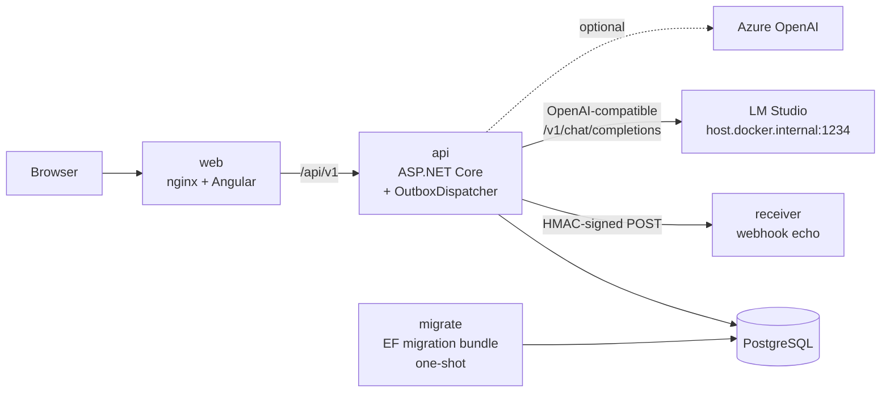
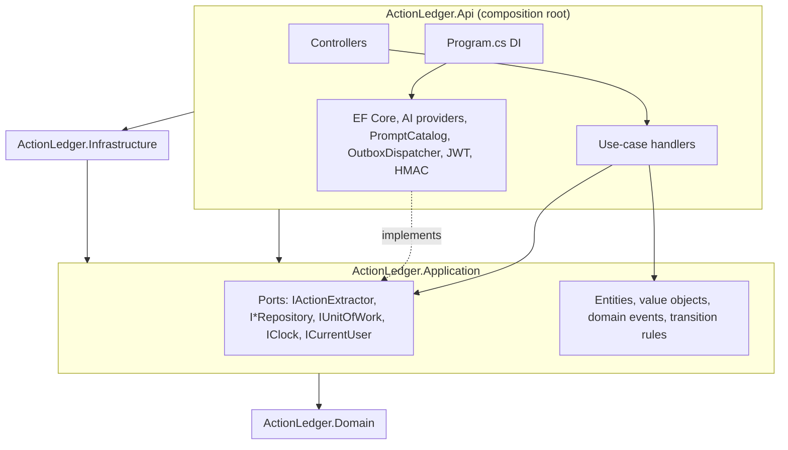
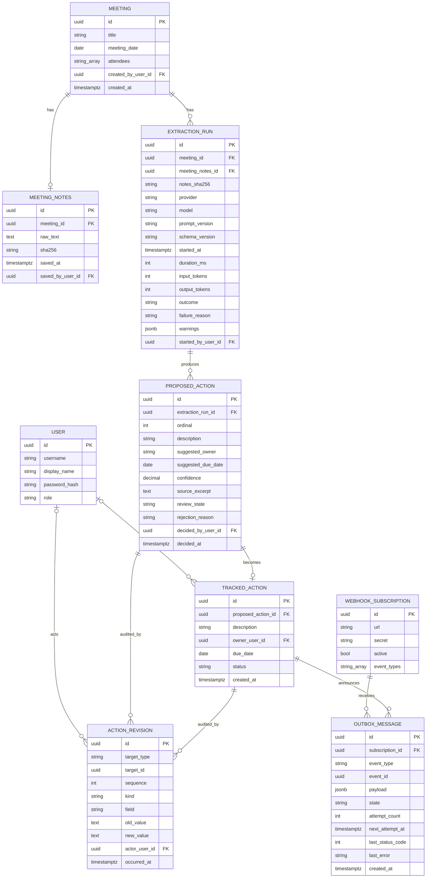
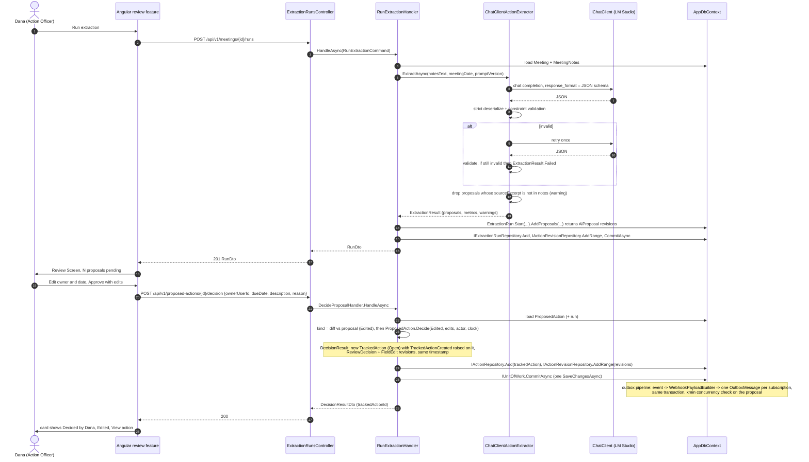
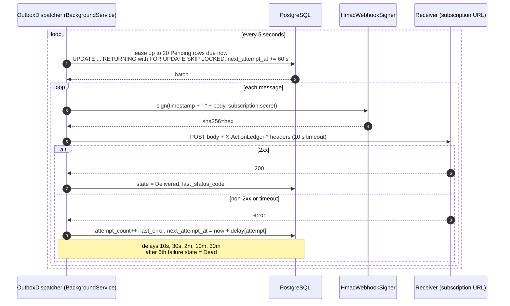

# ActionLedger Architecture

This document explains the architecture for human readers. The binding contract for builders is `ARCHITECTURE-SPINE.md`, whose `AD-n` decisions this document cites. Rationale for each major decision lives in `adrs/`.

## 1. Shape of the system

ActionLedger is one ASP.NET Core API, one Angular web app, one PostgreSQL database, and an outbox worker hosted inside the API process. An AI provider sits behind one seam. Everything ships as containers.

## 2. Layers

The backend is Clean Architecture with four rings. Dependencies point inward and a NetArchTest.eNhancedEdition suite fails the build when they do not (AD-1).

The controller is the C of MVC returning JSON instead of a view. A controller validates the HTTP shape, calls one handler or query, and maps the result to a DTO or a ProblemDetails (AD-2, AD-13).

### The provider swap proof point

The demo's central architectural claim is that switching the AI provider touches configuration and Infrastructure only.

- **Switch between built-in providers.** Change `Ai:Provider` to `LocalOpenAI`, `AzureOpenAI`, or `Fake` and restart. No code changes.
- **Add a provider.** Add one `IChatClient` factory class in `Infrastructure/Ai/providers` and one line in the DI switch. Domain and Application are untouched, and `Architecture.Tests` proves it because Application has no reference to any AI SDK (AD-1, AD-11).

The seam is `IActionExtractor` in Application. Its single Infrastructure implementation, `ChatClientActionExtractor`, does the prompt assembly, the structured-output request (`response_format` json_schema, which LM Studio, Ollama, and Azure OpenAI all accept), strict deserialization and constraint validation, and retry-once. It does not know which `IChatClient` it was given. Azure OpenAI is optional and uses the same OpenAI SDK pointed at Azure's `/openai/v1/` endpoint with an api-key, which is Microsoft's current documented path. The two real providers therefore differ only by base URL, model name, and credential.

## 3. Data model

Entity names match the PRD Glossary. The attributes shown are the ones the ADRs bind. The code owns the rest (AD-3 to AD-10).

Aggregate roots on the workflow path: `Meeting` owns its notes; `ExtractionRun` owns its proposals; `TrackedAction` and `ActionRevision` stand alone. The only mutation paths for Review State and Action Status are `ProposedAction.Decide` and `TrackedAction.Transition`. Each returns the audit revisions it produced for the handler to add (AD-3, AD-7). Every use case is one commit, and every state machine carries a concurrency token so two officers cannot both decide one proposal (AD-20).

## 4. Extraction and approval

One request runs an extraction and stores the run whether it succeeds or fails. A second request records the officer's decision, creates the Tracked Action, and enqueues the webhook, all in one commit.

## 5. Outbox webhook delivery

Delivery order per subscription is best effort: a message waiting for its next attempt does not block later ones (PRD FR-32). The worker runs inside the API process for v1; moving it to its own container changes registration, not code (AD-8, ADR-005).

## 6. Identity

Users are seeded with hashed passwords by the in-process seeder, from the fixture catalog, through the same aggregate methods as live writes (AD-21). `POST /api/v1/auth/login` returns an 8-hour HS256 JWT carrying `sub`, `name`, and `role`. Every handler reads the actor from `ICurrentUser`, which reads the `sub` claim. The one Lead-only operation is the Cancelled transition, which is how the demo shows authorization working (AD-12).

## 7. Frontend

The web app is built from Angular standalone components with signals and Angular Material. How MVVM maps onto Angular:

| MVVM | Angular | Rule |
| --- | --- | --- |
| View | Component template | Renders state, binds events. |
| ViewModel | Component class | Exposes signals and command methods. No `HttpClient`. |
| Model | Generated API client and DTO interfaces from `openapi.json` | The only shapes that cross the boundary. |

The feature folders are `auth`, `meetings`, `review`, `actions`, and `audit`. Each route has one smart container, with presentational children that take inputs and emit outputs. HTTP happens only in each feature's data service (AD-14). The full diagram lives in `docs/frontend-architecture.md`.

## 8. Deployment and environments

| Environment | How | AI provider |
| --- | --- | --- |
| Local dev | `docker compose up` (db, migrate, api, web, receiver) | `Fake` by default; `LocalOpenAI` pointed at LM Studio on the host |
| CI | GitHub Actions `ci.yml`: build, tests with Testcontainers, architecture tests, Angular lint/test/build, image build | `Fake` |
| Eval | `eval.yml` on `/prompts` or extractor changes and manual dispatch | `Fake` always; `LocalOpenAI` when `LOCAL_AI_BASE_URL` is set; report committed from a local run otherwise |
| Azure | `cd.yml` on merge to `main` and on `v*` tags: push images to a registry, run the migration bundle, deploy `api` and `web` to Azure Container Apps | `AzureOpenAI` or `Fake` |

Migrations never run inside the API at startup. The `migrate` service (compose) or CD step runs the EF migration bundle, and the API starts only after it exits successfully. When seeding is enabled, which it is in compose by default, the API then runs the idempotent demo seeder. The `web` image takes its API upstream from an environment variable so the same image serves compose and Azure. Its nginx proxy allows 200 seconds for the synchronous extraction call (AD-16, AD-17).

## 9. Testing

| Project | Scope | Notable test |
| --- | --- | --- |
| Domain.Tests | Transition tables for Review State and Action Status | Every invalid transition throws |
| Application.Tests | Handlers with the Fake provider and in-memory repositories | Edit-and-Approve writes revisions in the AD-7 order |
| Infrastructure.Tests | Real PostgreSQL via Testcontainers | NFR-3: fail after the outbox write and assert neither row exists; inserts-only persistence; proposal decision copy agrees with its revision |
| Api.Tests | WebApplicationFactory | 401, 403 on Cancelled as Action Officer, 409 on second notes save, 409 on a concurrent second decision, OpenAPI snapshot matches the committed file |
| Architecture.Tests | NetArchTest.eNhancedEdition | Application has no reference to EF Core, ASP.NET Core, or an AI SDK |
| Eval | Scorer over the fixture catalog | Fake provider scores 1.0; injection case yields no injected action; LocalOpenAI and AzureOpenAI scored when configured |
| Angular `*.spec.ts` | `ng test` | Container components and data services with the generated client mocked |
| Web.E2E | Playwright | UJ-1 happy path against compose with `Fake` |

## 10. Decisions

| ADR | Decision |
| --- | --- |
| [ADR-001](adrs/ADR-001-proposals-and-tracked-actions-separate.md) | Proposed Actions and Tracked Actions are separate tables |
| [ADR-002](adrs/ADR-002-immutable-notes-repeatable-runs.md) | Meeting Notes are immutable and extraction runs are repeatable |
| [ADR-003](adrs/ADR-003-prompt-version-and-model-on-every-run.md) | Prompt Version and model are stored on every run |
| [ADR-004](adrs/ADR-004-audit-explicit-revision-table.md) | Audit is an explicit revision table |
| [ADR-005](adrs/ADR-005-outbox-for-webhooks.md) | Webhooks go through a transactional outbox |
| [ADR-006](adrs/ADR-006-owner-free-text-resolved-on-approval.md) | Owner is free text until a human approves |
| [ADR-007](adrs/ADR-007-postgresql.md) | PostgreSQL, and what changes for SQL Server or Azure SQL |
